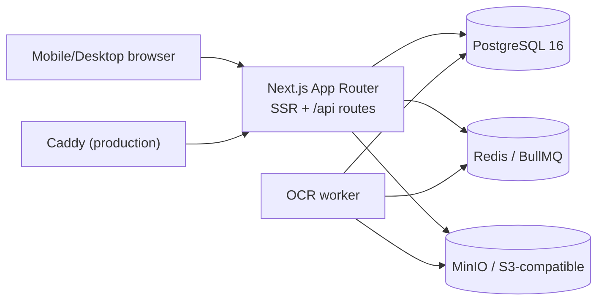
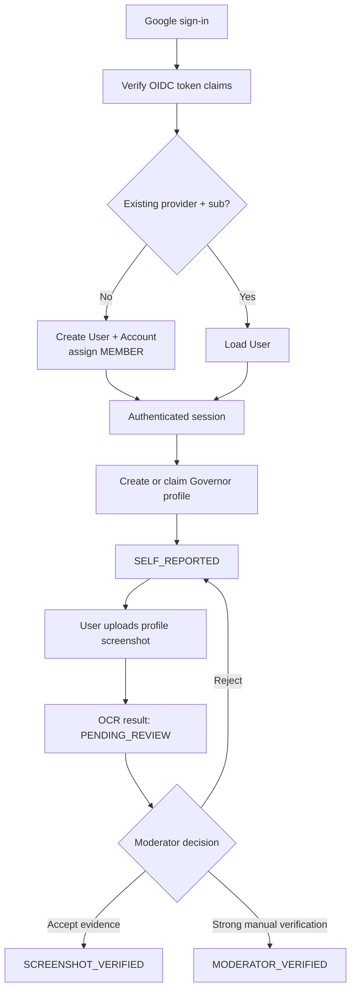

# RokViet Hub — System Specification

Version: 0.1.0 (architecture baseline)  
Status: Draft for MVP implementation

> RokViet Hub là dự án cộng đồng độc lập, không đại diện hoặc được tài trợ bởi Lilith Games.

## 1. Product scope

RokViet Hub is a mobile-first Vietnamese community platform for Rise of Kingdoms, combining:

- a searchable forum and Q&A archive;
- a community-authored Codex;
- six public, stateless calculators;
- user-owned Governor profiles and historical snapshots;
- reviewed community submissions.

The MVP is Vietnamese-first but every displayable domain entity uses stable i18n keys and supports both `vi` and `en` at the data boundary.

### Explicit non-goals

- No game automation, bot-controlled game actions, client reverse engineering, or calls to private/internal Rise of Kingdoms APIs.
- No claim that Google authentication verifies ownership of a Governor account.
- No automatic publication of OCR output or community submissions.
- No copying of prose or artwork from third-party community sites.

Game-related data is manually authored from public information, submitted by the community, imported by an authorized alliance leader, or extracted from a screenshot deliberately uploaded by its user and then reviewed.

## 2. Runtime architecture



Deployment is a modular monolith. Next.js owns HTTP and business orchestration; PostgreSQL is the source of truth. Redis is used only for cache, rate-limit state, and asynchronous jobs. Uploaded objects live outside PostgreSQL and are referenced by opaque object keys.

## 3. Module boundaries

| Module | Owns | May depend on |
|---|---|---|
| `identity` | users, OAuth identities, sessions, roles, reputation ledger | `i18n` for errors/UI only |
| `forum` | categories, topics, replies, votes, reports, tags | `identity`, optional Codex tag references at service layer |
| `codex` | commanders, equipment, talents, civilizations, troops, events, patches, revision history | `identity`, `i18n` |
| `tools` | calculator schemas and pure calculation functions | no database and no session |
| `kingdom` | kingdoms, alliances, Governor profiles, metric snapshots | `identity`, reviewed evidence from `ingestion` |
| `ingestion` | uploads, OCR jobs, submissions, moderation reviews, CSV import jobs | `identity`; publishes accepted data through application services |
| `i18n` | stable message keys and `vi`/`en` translations | none |

Cross-module writes must go through an application service/API, never through hidden database behavior. Database foreign keys are retained where ownership and lifecycle are unambiguous.

## 4. Identity and authorization

Auth.js handles Google OpenID Connect. The implementation must verify token signature, issuer, audience, and expiry. `provider + providerAccountId` (Google `sub`) is the stable external identity; email is contact data and is never used as the authentication key.

Roles are additive: `MEMBER`, `CONTRIBUTOR`, `MODERATOR`, `ADMIN`, `R4`, `R5`. Endpoint policies are defined in [API.md](./API.md). Mutation endpoints validate input with Zod and return stable error codes rather than localized prose.

### Governor verification flow



`SCREENSHOT_VERIFIED` means a moderator accepted user-provided screenshot evidence. It does not mean Lilith verified the profile. Every public response containing profile metrics must include `verificationStatus`, `source`, and `capturedAt`.

## 5. Data conventions

- Primary keys use CUID strings; public slugs are separate unique fields.
- Timestamps are UTC `DateTime`; clients localize them.
- Large game counters use `BigInt` in storage and decimal strings in JSON to avoid JavaScript precision loss.
- Soft state uses enums. Destructive moderation actions should preserve an audit record.
- Public names/titles reference stable `I18nMessage.key`; translations are rows keyed by `(messageId, locale)`.
- User-authored forum content remains plain text/Markdown content and records its source locale.
- Codex edits append immutable revisions tied to an editor and optional patch.
- Referential deletion defaults to `Restrict` for community content and `Cascade` only for true child records.

## 6. Search and jobs

MVP search uses PostgreSQL full-text search over topic title/body and approved Codex content. A switch to Meilisearch is considered only after roughly 5,000 indexed articles or demonstrated query limitations.

BullMQ queues:

- `ocr.profile`: parse user-uploaded profile screenshots;
- `mail.transactional`: notifications and account mail;
- `reputation.rebuild`: asynchronous reputation aggregation;
- `import.alliance`: validate and stage leader-provided CSV files.

Queue jobs are idempotent and persist status in PostgreSQL when user-visible.

## 7. API contract rules

- Base path: `/api`; JSON UTF-8 unless uploading a file.
- Success: `{ "data": ..., "meta": ... }`.
- Error: `{ "error": { "code": "STABLE_CODE", "details": {} } }`.
- Pagination uses opaque `cursor` plus `limit` (default 20, maximum 100).
- Calculator routes require no login and persist nothing.
- Writes require authentication except Auth.js callbacks; privileged writes require explicit role checks.
- Rate limiting is mandatory for sign-in, posting, reporting, uploads, OCR, and imports.

The MVP endpoint inventory and examples are maintained in [API.md](./API.md).

## 8. Prisma layout and build

The schema is split by bounded context under `prisma/schema/`. `schema.prisma` owns the generator and datasource; the remaining files own models/enums. Run Prisma against the schema directory:

```bash
npx prisma format --schema prisma/schema
npx prisma validate --schema prisma/schema
npx prisma migrate dev --schema prisma/schema
```

This requires a Prisma CLI version supporting multi-file schemas. The application must pin one compatible Prisma version rather than float on `latest`.

## 9. MVP acceptance criteria

- Stack starts through Docker Compose and exposes a health endpoint.
- Google sign-in creates one user per Google `sub`; repeat sign-in is idempotent.
- Members can create topics/replies, vote, report, and manage their own Governor profiles.
- Contributors can submit Codex changes; moderators/admins approve and publish them with revision history.
- Six calculators work without authentication and return deterministic results.
- Governor metrics clearly expose provenance and verification state.
- Vietnamese and English dictionary entries can coexist from the first migration.
- No runtime code calls a private game endpoint or automates gameplay.

